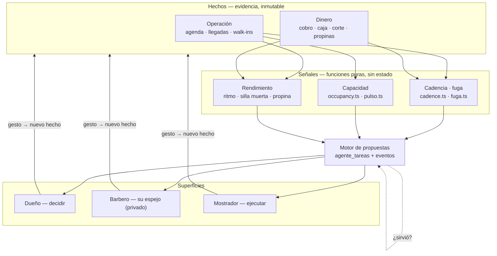
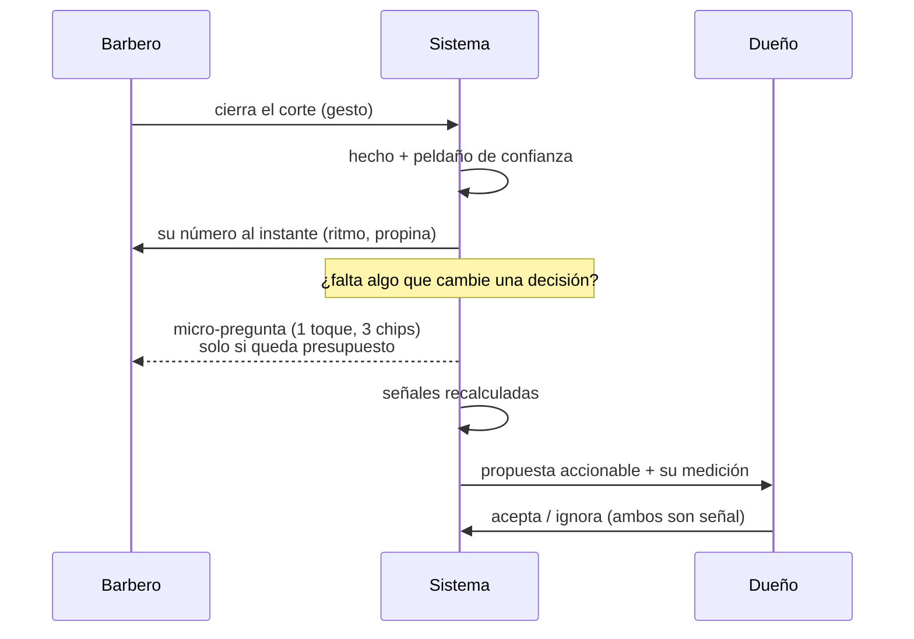

# Propuesta · Aprender del negocio sin volverlo tedioso

> **Estado: PROPUESTA.** No es una tarea del sprint y no autoriza código. Nace de
> una sesión ad-hoc del 2026-09-08 con Gabriel. El sprint sigue en `S10-DUE-01`
> (P1 🟢, P2 pendiente) y este documento no lo toca. Si algo de acá se ejecuta,
> entra antes como tarea al backlog de `SPRINT.md`, con su ID.

**La pregunta que lo origina.** *"¿Cómo diseño el sistema para que recabe la mayor
cantidad de información del negocio de forma creativa, con buena UX, sin que le
resulte tedioso al usuario — y que esa información sirva de verdad?"*

**La respuesta corta de este documento:** el sistema no debe pedir información.
El trabajo del día ya la produce; lo que falta es recogerla, devolverla, y solo
entonces —habiendo devuelto algo— ganarse el derecho a preguntar una cosa.

---

## 1. Desguace: no es un producto, son cuatro

Las decisiones que Gabriel nombró como "lo que hoy se toma a ciegas", ordenadas
por lo que cuesta capturar su insumo. El orden de ejecución sale de esta tabla,
no de qué suena más ambicioso.

| Decisión | ¿De dónde sale el dato? | Costo de captura | Veredicto |
|---|---|---|---|
| **A · Traer y retener clientes** — el pelo crece, el negocio vive de los recurrentes | 100 % subproducto de citas ya cerradas | **cero** | Núcleo |
| **B · Precio** | precio sellado + demanda observada | bajo, pero necesita meses de historia real | Fase 3 |
| **C · Manejo de barberos** — cubrir la falta, horario óptimo, ahorrar salario | disponibilidad + duración real + **costo por hora** | medio — el costo se declara | Fase 2 |
| **D · Rentabilidad del negocio como negocio** | renta, insumos, sueldos, servicios | **alto — ningún gesto lo produce** | Fase 3, acotado |

**Sobre D, dicho sin rodeos.** "Administración desglosada, si es rentable" es un
módulo contable. Ningún gesto de la barbería produce el costo de la renta ni el
del shampoo: eso solo se declara, mensualmente, por alguien que no tiene ganas.
Es el módulo que hunde a los productos de esta categoría — se llena una vez, se
desactualiza, y desde entonces todas las métricas mienten con cara de precisión.
Cuando entre, entra como **cinco números al mes**, no como contabilidad, y todo
lo que derive de ellos va marcado como estimado.

**Sobre A, que es el regalo.** La naturaleza recurrente del negocio hace que cada
corte cerrado ya declare el ciclo de esa persona. No hay que preguntar nada.

---

## 2. Lo que YA está construido (verificado el 2026-09-08)

El hueco es más chico de lo que la pregunta sugiere. Antes de diseñar nada
conviene mirar lo que existe, porque la mitad del motor está puesto:

| Pieza | Dónde vive | Qué resuelve ya |
|---|---|---|
| Cadencia personal (RFM, mediana del gap, atraso 1.5×) | `lib/cadence.ts` + `lib/retentionFeed.ts` | El corazón de **A**: quién está atrasado respecto de SU ritmo |
| Capacidad sin usar y faltas repetidas | `lib/fuga.ts` + `lib/fugaData.ts` | Dónde hay espacio, día × franja |
| Recompra por barbero | `lib/staffRecompra.ts` | Si los clientes de un barbero vuelven **a él** |
| Las cuatro señales de fracaso | `lib/senales.ts` | Si esto está funcionando o fallando en silencio |
| Ocupación y pulso | `lib/occupancy.ts`, `lib/pulso.ts` | Capacidad y ritmo del día |
| Tareas del agente con historia inmutable | `agente_tareas` + `agente_tarea_eventos` · `lib/agenteTareas.ts` | El primitivo de "proponer y medir". **0 filas, sin UI** |
| Propina privada del barbero | `appointment_tips` (RLS deny-all) · `lib/barberDay.ts` · `TipSheet` / `TipsSummary` | La privacidad asimétrica, **ya estructural** (tabla aparte + lint + repo-check) |
| Cierre de jornada del barbero | `components/staff/EndOfDaySummary.tsx` | La superficie del reconocimiento — hoy vacía de contenido (§5) |
| Escalera de confianza | `docs/planes/agente.md` §"La escalera de confianza" | El antídoto contra el dato tecleado al aventón. **Escrita, no materializada** |

**Conclusión honesta:** las señales están. Lo que falta no es analítica — es
**reciprocidad, disciplina de captura y un ciclo cerrado y medido**.

---

## 3. La tesis

> El sistema no *pide* información. El sistema hace que **el trabajo del día deje
> información como subproducto**, la devuelve al que la produjo, y solo entonces
> se gana el derecho a preguntar.

Tres fuentes, ordenadas por lo que le cuestan a la persona:

| Fuente | Costo | Integridad | Ejemplo real |
|---|---|---|---|
| **Subproducto del gesto** | cero | alta — el gesto *es* la evidencia | tocar "Llegó" ya da hora real, retraso, ocupación y ritmo |
| **Micro-pregunta oportuna** | 1 toque, cuando la respuesta es obvia | media-alta | al cerrar el cobro: el riel, con 3 chips |
| **Declaración explícita** | alto — es trabajo | baja si se abusa | catálogo, precios, horarios, costo por hora |

Y la regla dura que sostiene todo el diseño:

> **Ningún campo se captura sin un consumidor nombrado que cambie una decisión.**

Si no se puede decir qué decisión cambia, no se captura. Un dato sin lector no es
un activo: es deuda. Y en este dominio, además, es riesgo de fabricar evidencia —
la regla de `CLAUDE.md` ("presente no es ausente") aplica igual a la captura que a
la escritura.

---

## 4. Los dos usuarios difíciles, y por qué son el mismo problema

Gabriel nombró dos: **el asistente que está ahí por el sueldo** y teclea al
aventón, y **el barbero que no tiene por qué querer llenar la información del
patrón**. Se resuelven con la misma decisión, tomada en dos direcciones.

### 4.1 Contra el que teclea mal: la escalera manda, no la buena voluntad

La escalera de confianza de `agente.md` ya ordena los datos por **integridad**
(qué tan difícil es que sean otra cosa que lo que dicen): sellado-por-trigger,
confirmado-humano, default-sin-mirar, derivado, pendiente. La regla operativa que
esta propuesta agrega es de consumo, no de esquema:

- Ninguna lectura que sostenga **dinero** o una **decisión cara** se apoya en un
  peldaño 3 sin decir en pantalla que es estimado.
- Ante la duda, **degradar** (ya es la regla de `agente.md`): subestimar la
  confianza produce propuestas tímidas; sobreestimarla produce afirmaciones falsas.
- Lo que no se sabe se muestra como **pendiente con nombre** — nunca como cero.
  `CobrosSinRiel` y los cabos sueltos ya son exactamente esto.

Así el asistente flojo degrada la precisión de lo opcional y **nunca ensucia la
verdad del negocio**. La calidad deja de depender de que a alguien le importe.

> **Contradicción encontrada al verificar (dejarla escrita, no limpiarla).**
> `agente.md` cita `payment_method='efectivo'` (`lib/cobro.ts:23,59`) como el
> ejemplo canónico del peldaño "default-sin-mirar". **Ese ejemplo está vencido
> desde S9-OPS-06:** `resolveCobro` ya no cae en `DEFAULT_RAIL` y la action no
> escribe la columna cuando nadie la tocó (`lib/cobro.ts:69-75`). El peldaño 3
> sigue existiendo, pero su ejemplo se mudó: hoy el preseleccionado que una
> persona puede dejar sin mirar es el riel de `CajaMovimientos.tsx:71`, donde la
> columna sí es NOT NULL. Corregir la cita de `agente.md` es trabajo de una línea
> y no se hace acá.

### 4.2 A favor del barbero: su pantalla es su espejo, no el formulario del dueño

**No se le piden datos: se le devuelve su día.** Ritmo real por corte, silla
muerta, propinas de la semana, y micro-metas suyas ("cerrando 8 minutos antes cabe
uno más antes de las 8"). El dato limpio deja de necesitar disciplina y pasa a ser
**efecto secundario del interés propio**: toca "Llegó" y "Terminó" porque de ahí
sale *su* número, no el reporte del patrón.

Dos candados, y no son opcionales:

1. **Privacidad asimétrica.** El detalle personal del barbero es suyo; el dueño ve
   agregados del negocio. En cuanto el barbero sospecha que su espejo es el
   expediente con el que lo evalúan, empieza a manipularlo y se pierden las dos
   cosas. Esto **ya es estructural** para la propina (tabla aparte, RLS deny-all,
   lint y repo-check) y cualquier métrica personal nueva nace bajo el mismo molde.
2. **El reconocimiento se gana o se calla.** Ver §5.

---

## 5. El reconocimiento: el hueco concreto que hay hoy

`EndOfDaySummary` existe y ya tiene el lugar bien elegido —el final de la
jornada—, pero lo que dice es *"una frase impersonal aleatoria del pool (no habla
del barbero)"*. Es honesto (no finge saber) y es genérico, que es justo lo que
Gabriel quiere evitar.

La regla propuesta:

> **El cierre del día solo habla si detectó algo específico y verificable. Si no
> hay hallazgo, no dice nada.**

Un elogio genérico repetido es peor que el silencio: enseña a ignorar la app. Un
hallazgo, en cambio, es una afirmación sobre el mundo y por lo tanto está sujeto a
la misma regla dura del repo — se dice solo con evidencia, y con el peldaño que le
corresponde.

**Contrato del hallazgo** (módulo puro, sin DB ni React, mismo molde que
`cadence`/`senales`):

```ts
export type Hallazgo = {
  /** Qué se detectó. Discriminante cerrado: sin catch-all "otro". */
  tipo: 'mejor_dia_en_semanas' | 'recupero_clientes' | 'ritmo_mejorado'
      | 'silla_muerta_baja' | 'racha_sin_no_show';
  /** El número con su referencia, nunca el número solo. */
  dato: { valor: number; referencia: number; unidad: 'cortes'|'min'|'clientes'|'%' };
  /** Peldaño de la escalera del que depende la afirmación (agente.md). */
  confianza: 1 | 2 | 3 | 4;
  /** Texto ya redactado. Impersonal si confianza >= 3. */
  texto: string;
};

/** Devuelve [] cuando no hay nada que decir. El vacío es la salida normal. */
export function hallazgosDelDia(input: DiaDelBarbero): Hallazgo[];
```

Y su presupuesto: **como máximo un hallazgo por jornada**, el de mayor valor. Dos
son ruido; tres son una newsletter.

---

## 6. El presupuesto de atención

El mecanismo que convierte "que no sea tedioso" en una garantía y no en una
intención:

> Cada persona tiene un tope duro de micro-preguntas por jornada. **Arranca en 1.**
> El sistema gasta ese presupuesto en la incógnita de mayor valor y calla el resto
> del día.

Consecuencias, todas deseadas:

- Una pregunta que no cambia ninguna decisión **no se hace nunca**, aunque el dato
  "estaría bueno tenerlo". Esto es lo que impide que el producto degenere en encuesta.
- Preguntar tiene **costo de oportunidad**: para meter una pregunta nueva hay que
  argumentar que vale más que la que desplaza. La disciplina queda en el mecanismo,
  no en el criterio de quien programa.
- El presupuesto es **por persona y por rol**: el barbero con el cliente en la
  silla y el dueño a las diez de la noche no son el mismo usuario.

**Criterio de selección** (puro y ordenable): valor esperado = (cuánto cambia la
decisión que desbloquea) × (probabilidad de que la respuesta sea honesta en ese
momento) ÷ (fricción del gesto). Candidatos verificables hoy: el riel sin declarar
(`CobrosSinRiel` ya lo expone), el motivo de una falta repetida, si el cliente
pidió algo distinto de lo agendado.

```ts
export type MicroPregunta = {
  id: string;
  /** Momento exacto. No hay "cuando se pueda". */
  ancla: 'al_cerrar_cobro' | 'al_marcar_no_show' | 'cierre_de_jornada';
  /** 2 a 3 opciones + "saltar". Nunca texto libre. */
  chips: readonly string[];
  /** Consumidor NOMBRADO. Sin esto la pregunta no se emite. */
  consumidor: string;      // p.ej. 'fuga.motivo' | 'corte.sinRiel'
  valorEsperado: number;   // para el orden; el presupuesto corta arriba
};
```

**"Saltar" siempre está, y saltar es una respuesta:** deja `NULL` visible, que es
lo correcto, y baja el valor esperado de volver a preguntar lo mismo.

---

## 7. Mapa de contextos



Las tres reglas de límite que lo sostienen:

1. **Los hechos no se derivan; las señales no se guardan.** Cadencia, fuga y ritmo
   son funciones puras recalculables. En el momento en que se cachea una señal hay
   dos verdades y una se pudre. (Es lo que ya hacen los once módulos puros.)
2. **El motor es la única puerta que le habla a un humano con una sugerencia.**
   Cualquier superficie puede *mostrar* hechos; **proponer** pasa por una sola
   puerta, y así toda propuesta es medible por construcción.
3. **Toda propuesta nace con su medición.** Si no se puede saber si sirvió, no se
   emite. La decisión ya tomada en `S10-DUE-01` —la atribución se marca al
   agendarse, no en el pago— es exactamente esto.

### El ciclo



---

## 8. Plan por fases

### Fase 1 — un ciclo cerrado, no cuatro medios

**G1 · El espejo del barbero deja de ser genérico.** `hallazgosDelDia` como módulo
puro + `EndOfDaySummary` que calla cuando no hay hallazgo. Ritmo y silla muerta en
su pantalla, bajo el molde de privacidad de `appointment_tips`. **Va primero
porque sin reciprocidad la captura no se sostiene** y todo lo demás se cae encima.

**G2 · Presupuesto de atención + la primera micro-pregunta.** El mecanismo con su
tope de 1, y una sola pregunta —la de mayor valor esperado— anclada a un momento
existente. Nada de texto libre. Nada de segunda pregunta hasta medir la primera.

**G3 · El ciclo medido de la decisión A.** La propuesta de retención (que hoy
`cadence` ya calcula y `Panorama` ya muestra) pasa por `agente_tareas`, con su
evento de resultado. Es el **primer consumidor real** de una tabla que hoy tiene
0 filas, y cierra el lazo: proponer → aceptar/ignorar → ¿sirvió?

Cimientos que se pagan acá y no se rehacen: el peldaño de confianza como criterio
de consumo, las señales como funciones puras, el motor como puerta única, la
privacidad asimétrica. Nada de esto es andamio desechable.

### Fase 2 — capacidad y equipo (decisión C)

Cubrir la falta, el hueco, el horario óptimo. Entra acá y no antes porque necesita
el **primer dato caro declarado**: costo por hora del barbero. La columna ya está
sembrada (`staff.compensation_model`, hoy `NULL` en todos los registros y sin UI)
justamente para no pagar una migración después. Reusa `fuga` y `occupancy` sin
tocarlas.

### Fase 3 — precio y economía (decisiones B y D)

Elasticidad observada sobre historia real, y los cinco números del mes. Necesita
tráfico acumulado; hacerlo antes es inventar.

### Lo que no entra nunca

Inventario detallado, nómina completa, CRM de marketing. Cada uno es un producto
aparte y ninguno se paga con gestos.

---

## 9. Lo que esta propuesta NO hace

1. **No autoriza código.** Es un documento. Cada G de la Fase 1 sería su propia
   tarea en `SPRINT.md`, con su ID y su prompt.
2. **No reabre decisiones cerradas.** No toca la atribución de `S10-DUE-01`, ni la
   regla de qué se muestra como cobrado (`capa-de-dinero.md`), ni la escalera de
   `agente.md` — se apoya en las tres.
3. **No propone materializar la procedencia como columna.** `agente.md` ya decidió
   que se deriva; esta propuesta solo agrega **cómo se consume**.
4. **No adelanta el envío.** Nada de acá manda un mensaje: el envío proactivo sigue
   bloqueado por `S7-NOTIF-01` y `PLAT-01`, y este plan no lo destraba ni lo necesita.

## 10. Decisiones cerradas por Gabriel (2026-09-08)

Las tres preguntas que este documento dejó abiertas están respondidas. **No se
re-discuten**; si aparece una idea mejor, se anota como propuesta y se respeta la
decisión vigente.

1. **El orden se acepta.** G1 —el espejo del barbero— va primero, aunque no agregue
   ni un dato. Es la pieza que hace que todo lo demás funcione.
2. **El tope del presupuesto arranca en 1.** Deliberadamente incómodo. Subirlo a 2
   duplica la superficie de fricción y hay que quererlo con argumento.
3. **La primera micro-pregunta es el riel de cobro.** Es la elección coherente:
   S9-OPS-06 quitó el default `'efectivo'` porque inventaba evidencia y dejó
   `payment_method` en `NULL` cuando nadie declaró — correcto, y con un hueco real
   que el corte ya cuenta aparte (`sin_riel_snapshot`) y que `CobrosSinRiel` ya
   expone. La micro-pregunta lo llena por el único camino honesto: **una persona lo
   elige, en el momento en que la respuesta es obvia.**

Registrado en `SPRINT.md` como **S10-GES-01** (pasos G1…G3), ⚪ todo. **El encuadre
está cerrado; la ejecución no está aprobada.**

---

## 11. La tensión que G2 tiene que resolver, y que hoy está sin resolver

Elegir el riel como primera pregunta destapa un conflicto real con una decisión ya
tomada, y conviene dejarlo escrito antes de ejecutar:

> **D2 fijó que completar una cita no rompe el swipe de 2 segundos**, y de los tres
> caminos de "Terminó" del barbero **dos no preguntan nada** (`lib/cobro.ts`).

O sea: la micro-pregunta del riel **no puede ser un modal bloqueante sobre el
swipe**. Los dos caminos posibles, con sus costos:

| Camino | A favor | En contra |
|---|---|---|
| **Chip no bloqueante justo después del gesto** | La respuesta es obvia (el cobro acaba de pasar); máxima integridad | Compite con la atención del barbero que ya tiene al siguiente cliente; si se ignora, hay que decidir si consume presupuesto |
| **Barrido al cierre de jornada** sobre lo que `CobrosSinRiel` ya junta | Momento tranquilo; una sola interrupción para N cobros | La memoria a las 8 de la noche es peor: sube el riesgo de un peldaño 3 disfrazado de 2 |

**La elección se hace antes de escribir código, no durante.** Y si el barrido
nocturno gana, el diseño tiene que decidir explícitamente qué pasa cuando alguien
contesta "no me acuerdo" — la respuesta correcta sigue siendo `NULL` con nombre, no
un valor plausible.
